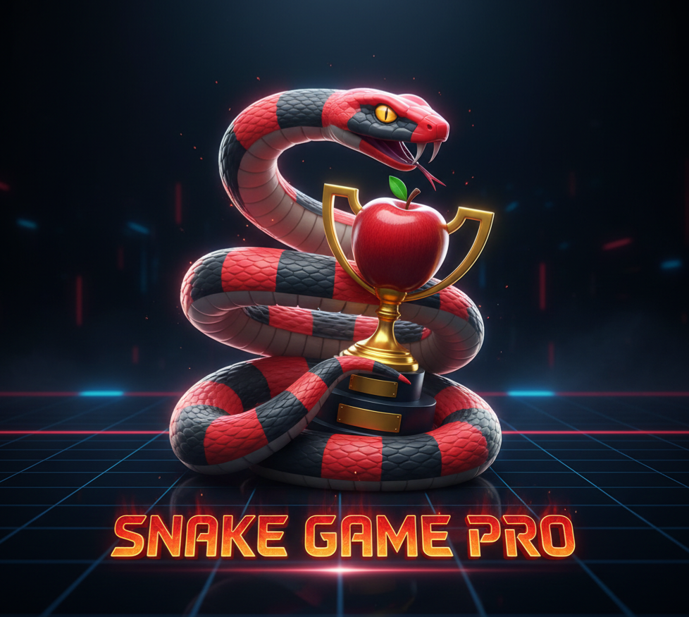

# 🐍 Snake Game Pro - Joystick Edition



Um clássico reinventado! Este é um jogo de cobrinha desenvolvido em Python com foco em jogabilidade fluida, visual personalizado e suporte completo a periféricos.

## 🚀 Funcionalidades
* **Três níveis de dificuldade:** Fácil, Médio e Difícil (com progressão de velocidade).
* **Suporte a Joystick:** Jogue com o D-Pad ou Analógico do seu controle (Xbox, PS4, Genéricos).
* **Sistema de Recordes Inteligente:** Salva o Top 5 de cada nível de forma independente.
* **Power-ups:** Pegue a poção para ficar invencível por 5 segundos (a cobra pisca!).
* **Interface Unificada:** Navegação simétrica com barras de menu padronizadas.

## 🎮 Controles

### No Teclado:
* **Setas:** Movimentam a cobra.
* **ALT + J:** Abre o menu de Níveis.
* **ALT + R:** Abre o menu de Recordes.
* **ESC:** Sai do jogo ou volta ao menu.

### No Joystick (Recomendado):
* **Analógico Esquerdo ou D-Pad (Setinhas):** Movimentam a cobra.
* **Botão A (ou X):** Inicia o jogo no menu.
* **Botão Start:** Encerra o jogo instantaneamente.

## 🛠️ Tecnologias
* **Linguagem:** Python 3.x
* **Biblioteca:** Pygame 2.6.1+

## 📦 Como Rodar
1. Certifique-se de ter o Python instalado.
2. Instale a biblioteca necessária:
   ```bash
   pip install pygame


